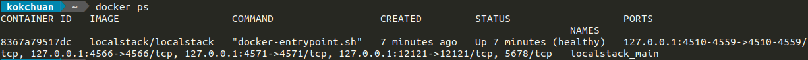
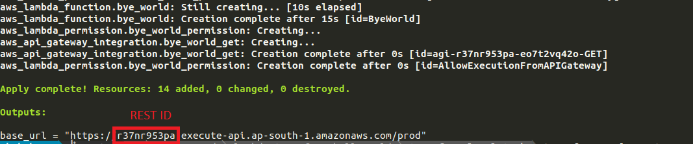

# Lambda Terraform Helloworld

This is a simple lambda project to:

- setup Terraform for lambda function instead of using AWS SAM CLI
- experiment applying Terraform in local machine using localstack
- create Github Action to orchestrate lambda resource in AWS and create CI/CD pipeline to deploy lambda function

Description below will cover AWS SAM CLI and Terraform implementation for both local testing and deployment.

---

## Prerequisite

- Node.js
- Docker
- [AWS SAM CLI](https://docs.aws.amazon.com/serverless-application-model/latest/developerguide/serverless-sam-cli-install.html)
- [Terraform](https://learn.hashicorp.com/tutorials/terraform/install-cli)
- [Localstack](https://localstack.cloud/)

## Local Testing

- Install npm packages

```
cd hello-world
npm install
cd ..
```

### AWS SAM CLI
1. Ensure you are in root directory

```
sam local start-api --debug
```

2. Test the result by going to http://127.0.0.1:3000/hello

### Terraform to Localstack

1. Boot up LocalStack
```
localstack start
```

2. Ensure localstack container is running
```
docker ps
```


3. Go to terraform-localstack directory and copy terraform variable file
```
cd terraform-localstack
cp auto.tfvars.example auto.tfvars
```

4. Init terraform
```
terraform init
```

5. Verify lambda resources that will be created
```
terraform plan
```

6. Create lambda resources in LocalStack
```
terraform apply
```

7. Get REST API ID from the output and construct the url from

`http://localhost:4566/restapis/${REST_API_ID}/prod/_user_request_/${REQUEST_PATH}`



For example go to http://localhost:4566/restapis/r37nr953pa/prod/_user_request_/hello

## Deployment

### AWS SAM CLI
```
sam deploy --guided
```

### Terraform

[Terraform Cloud](https://app.terraform.io/app) and AWS IAM (client id and secret key) is setup according to this [guide](https://learn.hashicorp.com/tutorials/terraform/github-actions). Also add AWS client id and secret key to [github repository secrets](https://docs.github.com/en/actions/security-guides/encrypted-secrets).

Github Actions setup includes [terraform plan](.github/workflows/terraform-plan.yaml) and [terraform apply](.github/workflows/terraform-apply.yaml) to orchestrate lambda resources. CI/CD pipeline deploys lambda function to AWS by zipping and executing `aws lambda update-function-code` command.

## Reference

- https://learn.hashicorp.com/tutorials/terraform/lambda-api-gateway?in=terraform/aws
- https://registry.terraform.io/providers/hashicorp/aws/latest/docs
- https://registry.terraform.io/providers/hashicorp/aws/latest/docs/guides/custom-service-endpoints#localstack
